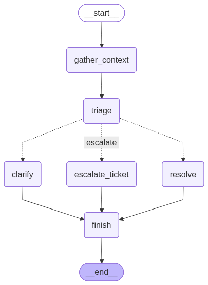
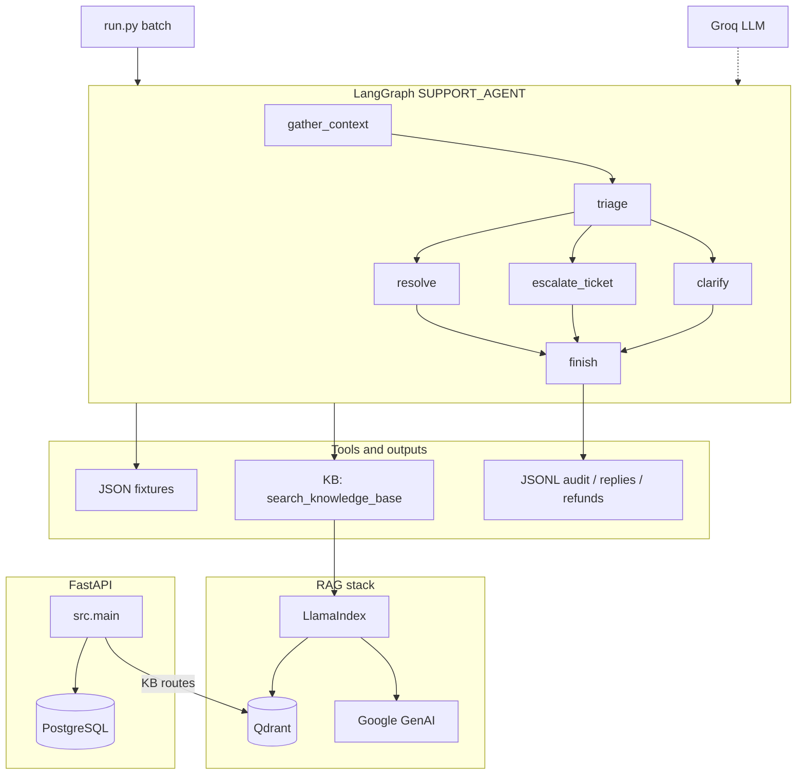

# Customer Support Agent

An async, tool-augmented customer support agent that processes customer tickets and routes each ticket to one of three outcomes:

- `resolve` (autonomous resolution),
- `escalate` (human handoff), or
- `clarify` (request missing details).

The system uses a **LangGraph** state machine with **Groq** LLM calls, deterministic tools (local JSON plus RAG over **Qdrant**), and an optional **FastAPI** service for database seeding, knowledge-base management, and triggering batch runs.

## Core architecture



The project has three main runtime pieces: a **batch ticket processor** (LangGraph + Groq), a **HTTP API** (FastAPI) for operations and integration, and a **RAG stack** (LlamaIndex, Google GenAI embeddings, Qdrant) used when the agent or API searches the knowledge base. The RAG flow also uses **Redis-backed caching** for query-level embedding reuse and LLM response reuse.



**LangGraph workflow.** Entry point is `gather_context` (loads customer/order/product context, KB excerpts, threat and ambiguity signals via tools). Next is `triage` (structured classification and `route`). Conditional routing sends the run to `resolve`, `escalate_ticket`, or `clarify`. All paths converge on `finish`, which writes structured audit output.

**Tooling.** Tools live in `server/src/agent/tools.py`: lookups and policy checks against JSON catalogs, `search_knowledge_base` wired to the RAG pipeline, escalation and messaging helpers. Refunds and replies are guarded by eligibility rules enforced in prompts and tools.

**RAG.** The knowledge base flows through a dedicated ingestion and retrieval pipeline (see **RAG pipeline features** below). API routes: `/api/injest-knowledge-base`, `/api/retrieve-knowledge-base` under `/api`.

### RAG pipeline features

**Ingestion** (`server/src/rag/injest.py`)

- **Source:** `server/src/rag/knowledge-base.md` with metadata (e.g. `source` filename).
- **Embeddings:** Google GenAI **`gemini-embedding-001`** via LlamaIndex (`GoogleGenAIEmbedding`).
- **Vectors:** Qdrant collection **`knowledge_base`** — **3072-dimensional** vectors, **cosine** distance; the collection is **created automatically** if it does not exist.
- **Indexing & persistence:** **`VectorStoreIndex`** with **`store_nodes_override=True`** and **`storage_context.persist("./storage")`** so the **docstore** is on disk — required for **BM25** lexical retrieval at query time.

**Retrieval** (`server/src/rag/retrieve.py`)

- **Connection:** **Async Qdrant** (`AsyncQdrantClient` / gRPC-oriented client in `server/src/rag/qdrant.py`) for non-blocking vector access; sync client used for ingestion.
- **Index load:** **`load_index_from_storage`** merges the persisted `./storage` docstore with the live Qdrant vector store.
- **Hybrid retrieval:** **`QueryFusionRetriever`** over (1) **dense** vector search (`similarity_top_k=5`) and (2) **`BM25Retriever`** on the docstore (`similarity_top_k=5`), with **`num_queries=3`** query variants and **`reciprocal_rerank`** fusion.
- **Reranking:** **`SentenceTransformerRerank`** (`cross-encoder/ms-marco-MiniLM-L-6-v2`, **`top_n=3`**).
- **Query rewriting:** **`HyDEQueryTransform`** (`include_original=True`) wrapped with **`TransformQueryEngine`** to improve recall on paraphrased questions.
- **Generation:** **`RetrieverQueryEngine`** → async LLM completion via **`get_llm_response_async`** (e.g. **Groq** `qwen/qwen3-32b` in current settings).
- **Observability:** stage **timing logs** for Qdrant connect, storage load, retriever setup, reranker, HyDE, and LLM latency.

**Caching.** Redis is used in two places for faster repeated queries:
- Query-level embedding cache via LlamaIndex embedding cache integration (`Settings.embed_model(..., embeddings_cache=redis_kv)`).
- LLM response cache keyed by normalized query and filter hash (`server/src/rag/query_helpers.py`), with TTL-based expiry.

**Persistence.** Batch runs emit JSONL traces under `server/src/` (for example `audit_log.jsonl`, `replies_sent.jsonl`). The FastAPI app uses async SQLAlchemy against PostgreSQL (see Alembic migrations under `server/alembic/`) for seeded demo data and related features.

## Repository layout

| Path | Role |
|------|------|
| `server/src/main.py` | FastAPI application and CORS |
| `server/src/router/api.py` | REST routes (`/api/...`) |
| `server/src/agent/` | LangGraph graph (`agent.py`), prompts, typed `state`, tools |
| `server/src/run.py` | Concurrent batch runner over `tickets.json` |
| `server/src/rag/` | Qdrant (sync/async), ingest, hybrid retrieval pipeline |
| `server/src/models/`, `server/src/services/` | SQLAlchemy models and DB services |
| `server/src/*.json` | Fixture data for tools and batch runs |
| `client/` | Frontend (Vite + React), if used |

## Tech stack

- **Agent:** Python 3.10+, LangGraph, LangChain Groq (`ChatGroq`), Pydantic structured outputs, asyncio concurrency (`AGENT_CONCURRENCY`).
- **API:** FastAPI, SQLAlchemy (async), Alembic, PostgreSQL.
- **RAG:** LlamaIndex, `qdrant-client` (sync ingest + async query), Google GenAI embeddings (`gemini-embedding-001`), Qdrant vector store, **BM25 + QueryFusionRetriever** hybrid search, **cross-encoder reranking**, **HyDE** query transform, Redis embedding cache.
- **Data:** Local JSON fixtures for the agent; PostgreSQL for the API-backed workflow.

## Configuration

Environment variables are loaded from `server/.env` (see `server/src/utils/config.py`). Typical keys include:

- **Agent:** `GROQ_API_KEY`, `GROQ_MODEL`, `GROQ_LLM_MAX_RETRIES`, `GROQ_AMBIGUITY_MODEL`, `AGENT_CONCURRENCY`
- **Database:** `DATABASE_URL`, `DATABASE_URL_SYNC`
- **RAG / cloud:** `GOOGLE_API_KEY`, `QDRANT_CONNECTION_STRING`, `QDRANT_API_KEY`, `REDIS_URI`
- **API:** `FRONTEND_URL` (CORS)

## Setup

1. Create and activate a virtual environment (recommended under `server/` or the repo root).
2. Install Python dependencies for the server (from your lockfile or requirements; include `fastapi`, `uvicorn`, `langgraph`, `langchain-groq`, `qdrant-client`, `llama-index-*`, SQLAlchemy, async driver for PostgreSQL, etc.).
3. Copy/configure `server/.env` with the variables above.
4. Apply database migrations if using the API (`alembic upgrade head` from `server/` when configured).

### Example: venv (PowerShell)

```powershell
cd server
python -m venv .venv
.\.venv\Scripts\Activate.ps1
pip install <your-dependencies>
```

## How to run

### Batch agent (all tickets in `tickets.json`)

Run as a module so `import src.*` resolves (`tickets.json` lives next to `run.py` under `server/src/`):

```powershell
cd server
python -X utf8 -m src.run
```

Optional concurrency override:

```powershell
$env:AGENT_CONCURRENCY="5"
python -X utf8 -m src.run
```

### HTTP API

From `server/`:

```powershell
uvicorn src.main:app --reload --host 0.0.0.0 --port 8000
```

Use `/health` for a quick check. API routes are prefixed with `/api` (for example `/api/seed-db`, `/api/retrieve-knowledge-base`, `/api/injest-knowledge-base`, `/api/run-support-agent`).

## Outputs (batch runs)

Each batch run clears and rewrites JSONL logs under `server/src/`:

- `audit_log.jsonl` — full per-ticket decision trace
- `replies_sent.jsonl` — outbound customer replies
- `escalations.jsonl` — human escalations
- `refunds_issued.jsonl` — issued refunds
- `dead_letter.jsonl` — tool calls that failed after retries

## High-level agent flow

1. **`gather_context`** — customer lookup, KB retrieval, threat-intent scan, order/product linkage, ambiguity check.
2. **`triage`** — classify ticket, urgency, confidence, fraud hints, and choose `route`.
3. **Route**
   - **`resolve`** — policy- and eligibility-guarded actions (refund cap, exchange vs escalation, etc.).
   - **`escalate_ticket`** — human handoff plus customer-facing notice.
   - **`clarify`** — request missing identifiers or intent.
4. **`finish`** — persist audit summary and structured log line.
